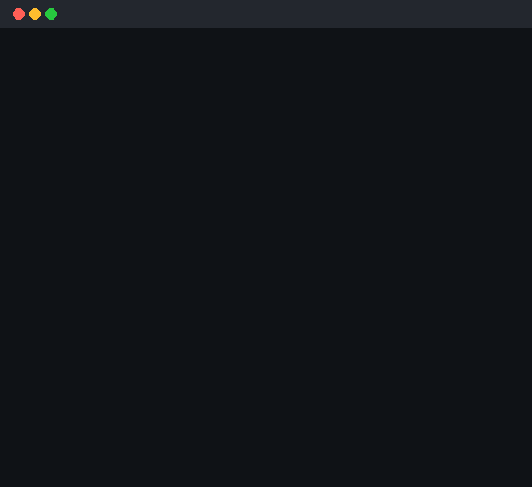
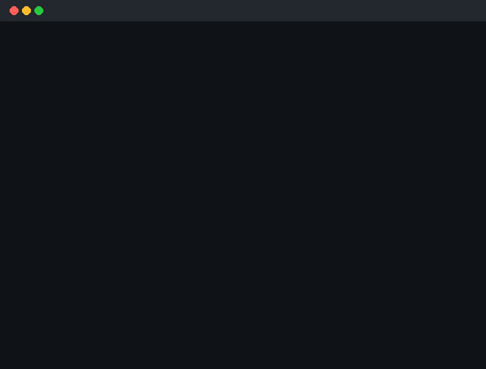

# Brain Games

[](https://github.com/aisaenok/frontend-project-44/actions)
[](https://sonarcloud.io/summary/new_code?id=my-org-ai_hexlet)
[](https://sonarcloud.io/summary/new_code?id=my-org-ai_hexlet)
[](https://sonarcloud.io/summary/new_code?id=my-org-ai_hexlet)

## Description

**Brain Games** — набор из пяти консольных математических игр, запускаемых из терминала.

В проект входят игры:

- **Проверка на чётность**
- **Калькулятор**
- **НОД**
- **Арифметическая прогрессия**
- **Простое ли число**

Проект выполнен на **JavaScript** в среде **Node.js** с использованием **ES Modules**.

---

## Minimum requirements

- Node.js >= 18
- npm >= 9
- Unix-like shell / Git Bash / terminal

---

## Installation

### 1. Clone repository

```bash
git clone https://github.com/aisaenok/frontend-project-44.git
cd frontend-project-44
```

### 2. Install dependencies
```bash
make install
```

### 3. Link package globally
```bash
npm link
```

## Available commands

### Run games

```bash
brain-games
brain-even
brain-calc
brain-gcd
brain-progression
brain-prime
```

### Local run via Makefile

```bash
make brain-games
make brain-even
make brain-calc
make brain-gcd
make brain-progression
make brain-prime
```

## Games

### Brain Even
Нужно ответить `yes`, если число чётное, иначе `no`.

Демонстрация успешного и неуспешного прохождения игры «Проверка на чётность».


### Brain Calc
Нужно вычислить результат выражения.

Демонстрация успешного и неуспешного прохождения игры «Калькулятор».


### Brain GCD
Нужно найти наибольший общий делитель двух чисел.

Демонстрация успешного и неуспешного прохождения игры «НОД».



### Brain Progression
Нужно определить пропущенное число в арифметической прогрессии.

Демонстрация успешного и неуспешного прохождения игры «Арифметическая прогрессия».


### Brain Prime
Нужно ответить `yes`, если число простое, иначе `no`.

Демонстрация успешного и неуспешного прохождения игры «Простое ли число».


